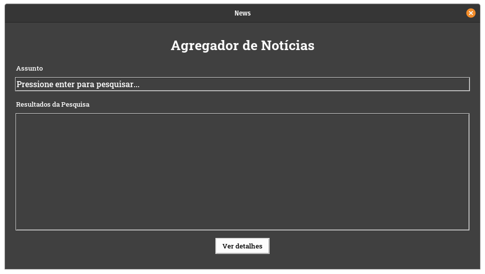
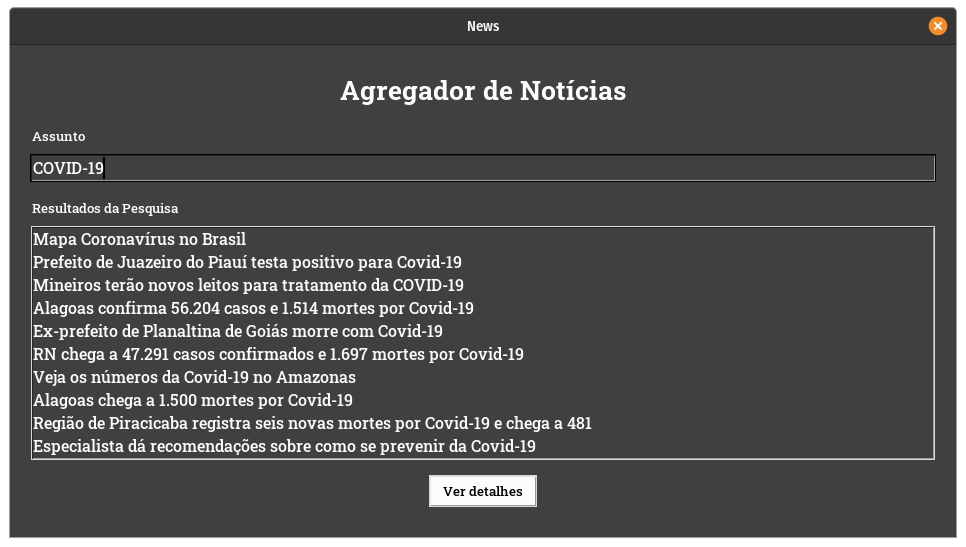
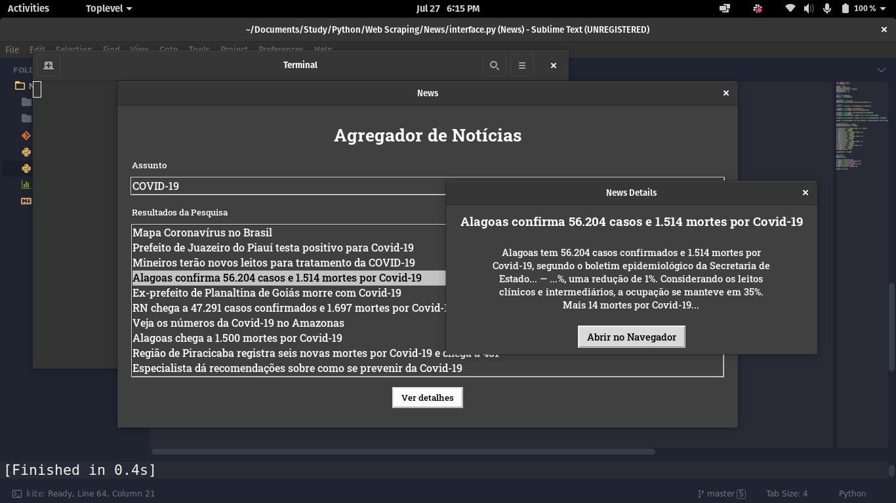

# Web Scraping com Python: Agregador de Notícias

Uma aplicação em Python que utiliza Web Scraping para acessar notícias no G1 a respeito de um assunto especificado pelo usuário em uma interface gŕafica.

## Funcionalidades

- Caixa de texto que permite informar o assunto que se deseja pesquisar no G1.
- Pressionando a tecla Enter, os resultados (manchetes) aparecerão na lista abaixo.
- Dois cliques sobre a manchete de um notícia carrega uma nova janela que contém detalhes sobre a notícia.
- Clicando no botão `Abrir no Navegador`, o link da notícia será carregado no seu navegador padrão.

## Screenshots

### Página Inicial

### Resultados da Pesquisa

### Detalhes da Notícia

